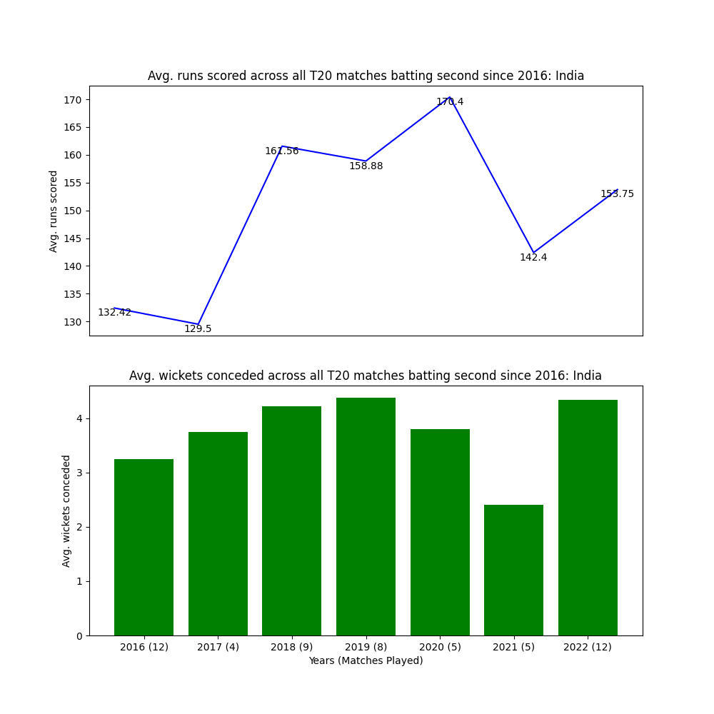
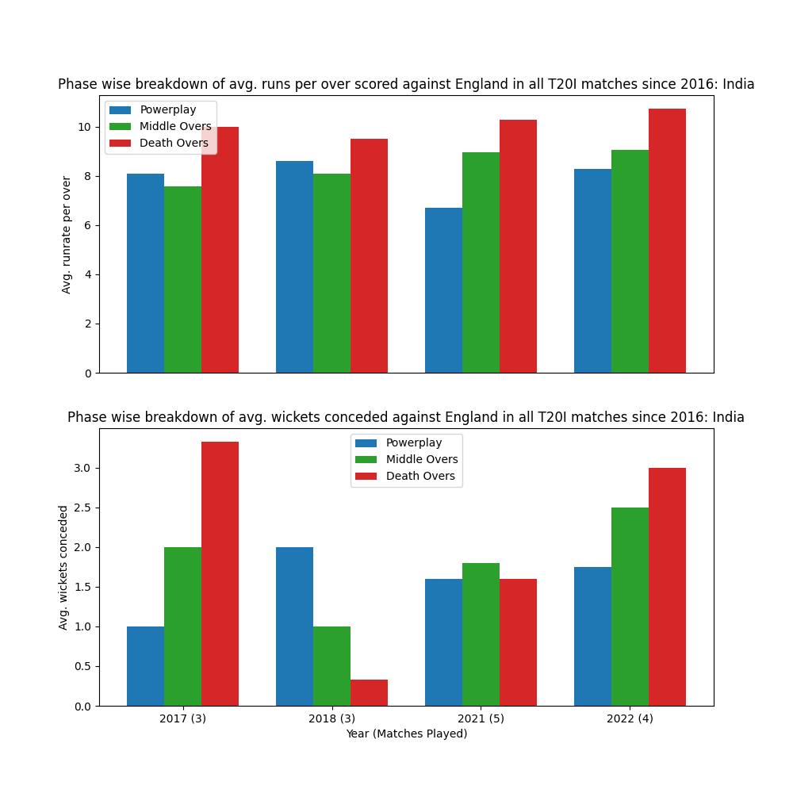
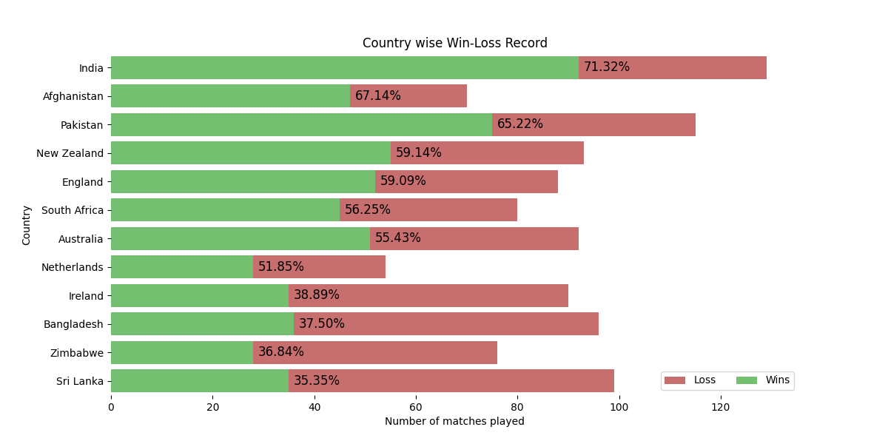

# Data Visualization README
## Table of contents
1. [Performances using ground avergaes](#ground)
    * [ground_average_reference](#ground)
    * [ground_average_visuals](#groundvis)
    * [ground_average](#groundavg)
2. [Strenghts and weakness insights using win loss analysis](#plots123)
3. [World Cup win loss and average Analysis](#wcstats)
4. [Win Loss Analysis](#winloss)


### ground_average_reference.py<a name=ground></a>

### ground_average_visuals.py<a name=groundvis></a>

### ground_average.py<a name=groundavg></a>

### plots_1_2_3.py<a name=plots123></a>

#### Description

This file contains 3 functions which compute the following metrics in various conditions as well as specific customisations, as described below:

* Function make_plots_1 -> computes the win-loss % for a team for every year from 2016-2022 for 3 conditions:
    * across all T20I matches played since 2016
    * across all T20I matches in which the team batted first since 2016
    * across all T20I matches in which the team batted second since 2016
    
    You can choose to compute this metric for a team against all opponents in this time frame, or against a specific opponent in this time frame, by mentioning the specific argument
    
* Function make_plots_2 -> computes the average runs scored and wickets conceded for a team for every year from 2016-2022 for 3 conditions:
    * across all T20I matches played since 2016
    * across all T20I matches in which the team batted first since 2016
    * across all T20I matches in which the team batted second since 2016
    
    You can choose to compute this metric for a team against all opponents in this time frame, or against a specific opponent in this time frame, by mentioning the specific argument
    
* Function make_plots_3 -> computes the average runs scored and wickets conceded in every phase of the match for a team for every year from 2016-2022 for 3 conditions:
    * across all T20I matches played since 2016
    * across all T20I matches in which the team batted first since 2016
    * across all T20I matches in which the team batted second since 2016
    
    You can choose to compute this metric for a team against all opponents in this time frame, or against a specific opponent in this time frame, by mentioning the specific argument
    
#### Input-output

**def make_plots_1(db, team_1, team_2 = "All")** 

Input : 
param db: Database ; pandas Dataframe
param team_1: Team for which win-loss is to be calculated; str
param team_2: Team against which win-loss is to be calculated; str; default value = all

Output:

India against all oppositions


India against England


**def make_plots_2(db, team_1, team_2 = "All")**

Input : 
param db: Database ; pandas Dataframe
param team_1: Team for which the metrics are to be calculated; str
param team_2: Team against which the metrics are to be calculated; str; default value = all

Output:

India against all oppositions




India against England


**def make_plots_3(db, team_1, team_2 = "All")**

Input : 
param db: Database ; pandas Dataframe
param team_1: Team for which the metrics are to be calculated; str
param team_2: Team against which the metrics are to be calculated; str; default value = all

Output:

India against all oppositions


India against England



#### Requirements

Follow the instructions mentioned under "Requirements" and "Running Ccode" in the Readme file on the root directory page. You can also refer to the Jupyter notebook at https://github.com/jvolheim/ECE-143/blob/main/DataVisualization/ECE143_Group_15.ipynb, to understand how to run the visualisation files for plots. 

### wc_stats.py <a name=wcstats></a>

This file is used to analyse the performance of teams during the world cup. Different functions are:
1. seperate_wc()  
This function seperates the world cup matches related data from complete data

2. average_inng_total()  
This function is to find average innings score for each team for a particular innings. Innings number can be passed as parameter.

3. plot_avg_scores()  
This function plots the average score of both innings for all teams into stacked horizontal bar chart

4. win_loss_inn_wise()    
This functions returns team wise statistics for world cup (matches played, wins, win percent)


5. win_loss_compare()  
This function analyses win loss percentage for world cup playing teams and plots them. Since the data was quite small (maximum 7 matches per team, we decided to skip this plot in the presentation)


#### Running this file
Please run this file from the root directory using 
```
python .\DataVisualization\wc_stats.py
```


#### Plots


### win_loss.py <a name=winloss></a>

This file just has a single function winloss() that takes in complete data and plots wins and losses for each team and also prints out win percent. 

#### Running this file
Please run this file from the root directory using following command. 
```
python .\DataVisualization\winloss.py
```

#### Plots

