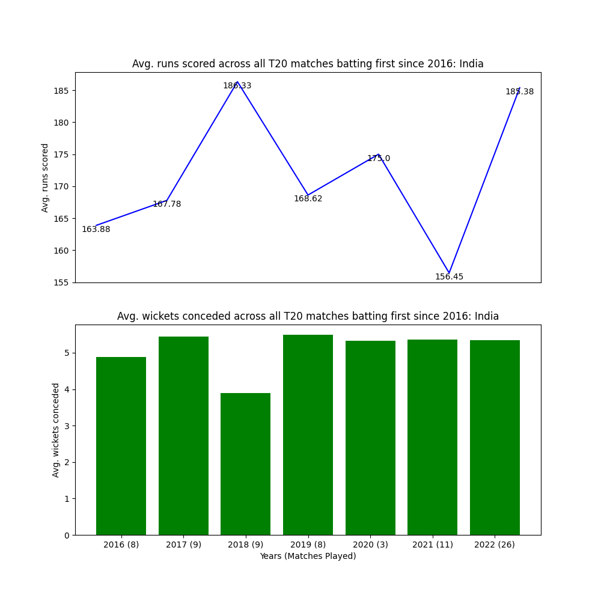
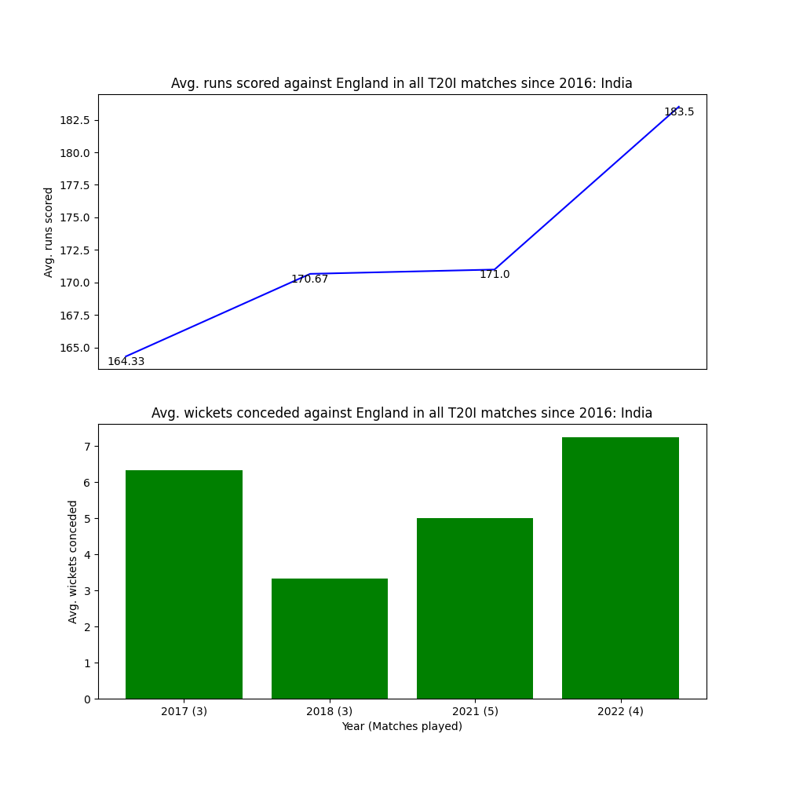
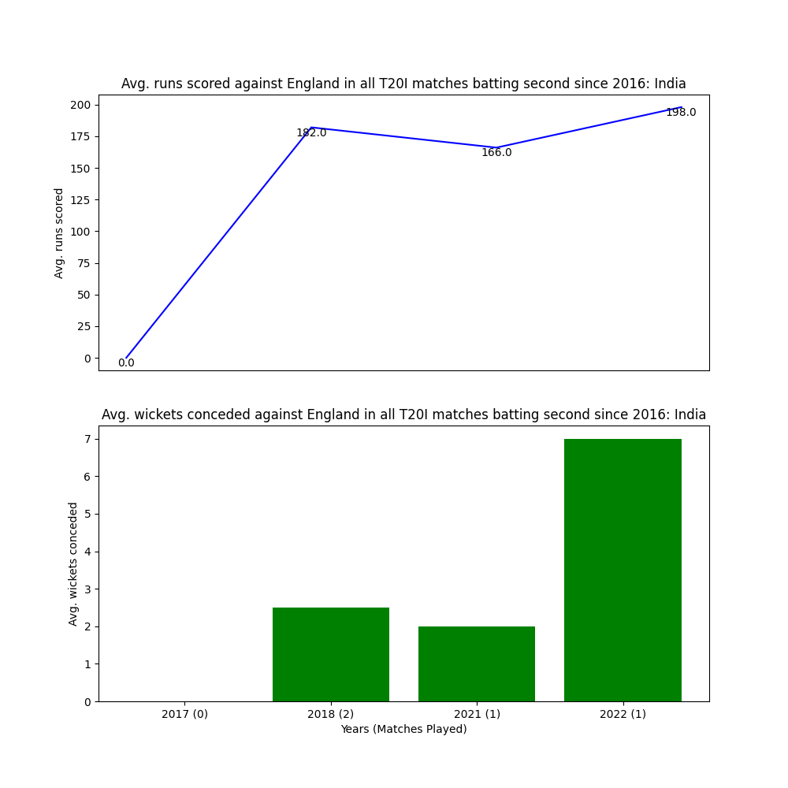
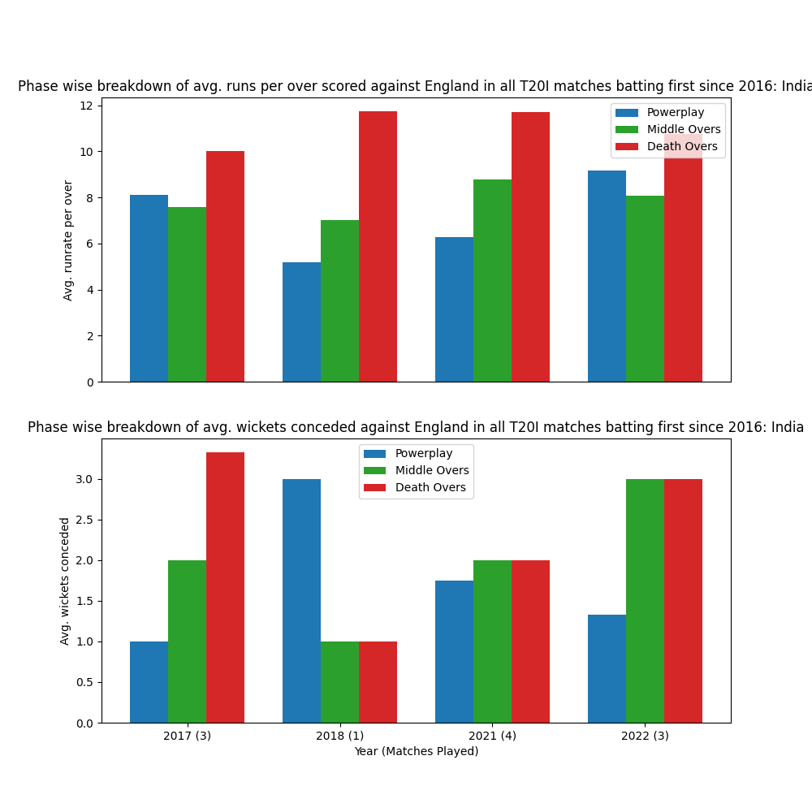
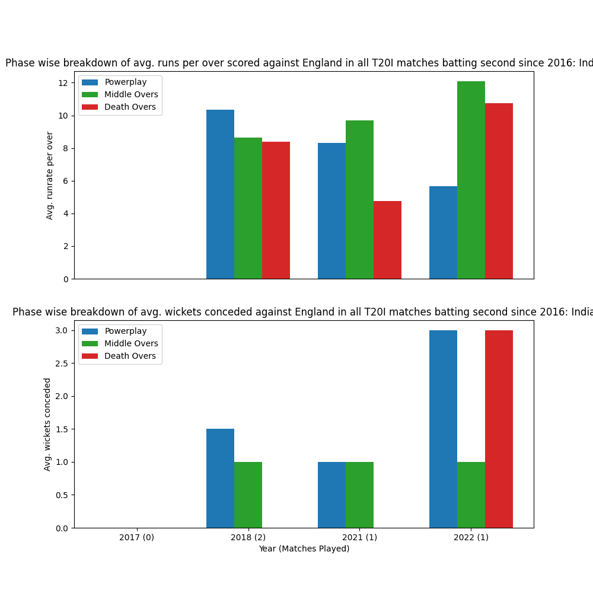

## Visualization ReadMe

    Add brief description of each python file and what it does for an example you can
    look at the readme file in Data processing and the requirements in the root directory 
    Readme file

### ground_average_reference.py

### ground_average_visuals.py

### ground_average.py

### plots_1_2_3.py

#### Description

This file contains 3 functions which compute the following metrics in various conditions as well as specific customisations, as described below:

* Function make_plots_1 -> computes the win-loss % for a team for every year from 2016-2022 for 3 conditions:
    * across all T20I matches played since 2016
    * across all T20I matches in which the team batted first since 2016
    * across all T20I matches in which the team batted second since 2016
    
    You can choose to compute this metric for a team against all opponents in this time frame, or against a specific opponent in this time frame, by mentioning the specific argument
    
* Function make_plots_2 -> computes the average runs scored and wickets conceded for a team for every year from 2016-2022 for 3 conditions:
    * across all T20I matches played since 2016
    * across all T20I matches in which the team batted first since 2016
    * across all T20I matches in which the team batted second since 2016
    
    You can choose to compute this metric for a team against all opponents in this time frame, or against a specific opponent in this time frame, by mentioning the specific argument
    
* Function make_plots_3 -> computes the average runs scored and wickets conceded in every phase of the match for a team for every year from 2016-2022 for 3 conditions:
    * across all T20I matches played since 2016
    * across all T20I matches in which the team batted first since 2016
    * across all T20I matches in which the team batted second since 2016
    
    You can choose to compute this metric for a team against all opponents in this time frame, or against a specific opponent in this time frame, by mentioning the specific argument
    
#### Input-output

**def make_plots_1(db, team_1, team_2 = "All")** 

Input : 
param db: Database ; pandas Dataframe
param team_1: Team for which win-loss is to be calculated; str
param team_2: Team against which win-loss is to be calculated; str; default value = all

Output:

India against all oppositions

India against England

**def make_plots_2(db, team_1, team_2 = "All")**

Input : 
param db: Database ; pandas Dataframe
param team_1: Team for which the metrics are to be calculated; str
param team_2: Team against which the metrics are to be calculated; str; default value = all

Output:

India against all oppositions

India against England

**def make_plots_3(db, team_1, team_2 = "All")**

Input : 
param db: Database ; pandas Dataframe
param team_1: Team for which the metrics are to be calculated; str
param team_2: Team against which the metrics are to be calculated; str; default value = all

Output:

India against all oppositions

India against England

#### Requirements

Follow the instructions mentioned under "Requirements" and "Running the code" in the Readme file on the root directory page

### wc_stats.py

## win_loss,py 

